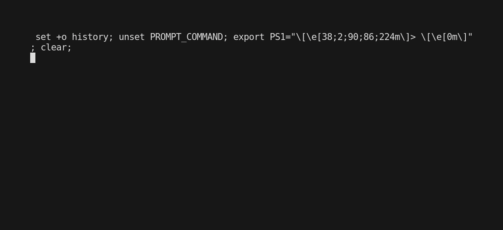

# mdpaper

*Blazingly* fast highly opinionated markdown to pdf 1.5 converter aimed at writing scientific papers, e.g. in University.

## Getting started

### Installation

Either download the latest release from the releases page or install with go:

```bash
go install github.com/sett17/mdpaper@latest
```

## Usage

Every available option can be set in the markdown file with a YAML frontmatter.

```bash
mdpaper my_paper.md
```

You can also include multiple markdown files, which will act as if they were concatenated into a single file.

```bash
mdpaper abstract.md draft.md ackowledgements.md
```

You can also set the path to the config file (e.g. if you want to have multiple configs) with `-c` or `--config`.

```bash
mdpaper -c single.yaml my_paper.md
```



## How do I write a paper?

Everything from features through to configuration, and supported elements is documented in the [References](REFERENCE.md) file.

# Acknowledgements & Known Issues

Thanks to the people behind:

- [goldmark](https://github.com/yuin/goldmark) for the markdown parser
- [bibtex](https://github.com/nickng/bibtex) for the bibtex parser
- [mermaid](https://github.com/mermaid-js/mermaid) for great looking diagrams
- [chroma](https://github.com/alecthomas/chroma) for the code highlighting
- [Furqan Software](https://github.com/FurqanSoftware/goldmark-katex) for goldmark math extender code


- Paragraphs that are split in the beginning may be out of order
  - use '\fill' in the meantime to force a column break and avoid the splitting
