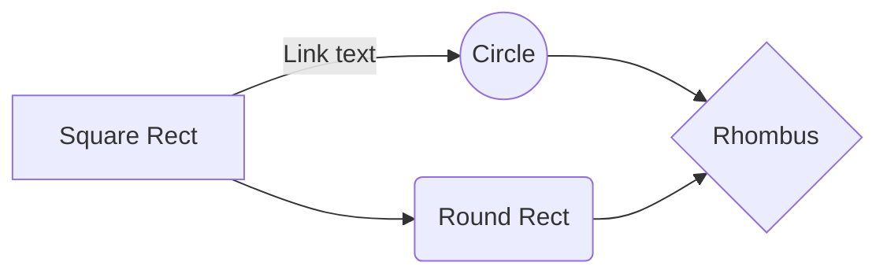

# Reference

This reference guide serves as a comprehensive resource for users of the mdpaper tool. It explains the various components and settings of mdpaper and provides examples of how they can be used to generate scientifically formatted PDFs from markdown files. Whether you are new to mdpaper or an experienced user, this guide will help you understand and make the most of the tool's capabilities.

Please note that this reference guide is **not necessarily up-to-date
** with the latest version of the mdpaper tool. It currently corresponds to version `v1.9.2`, and some features or functionality may have changed in later versions. If you are using a different version of mdpaper, some information in this guide may not apply.

# What is mdpaper?

mdpaper is a tool written in `GO` that allows users to generate scientifically formatted PDFs from markdown files. It has a variety of features and settings that enable users to customize the PDFs to their specific needs. mdpaper can be installed and used via the command line interface (CLI) on any operating system by using the `go install` command and cloning the GitHub repository at [github.com/sett17/mdpaper](https://github.com/sett17/mdpaper). Alternatively, users can download the pre-compiled executable from the repository page. In this reference guide, we will explain the various components and settings of mdpaper and how they can be used to generate high-quality PDFs.

## How does mdpaper work?

mdpaper follows these steps to generate formatted PDFs from markdown files:

1. Parse the markdown file and any additional files such as a configuration file or bibliography.
2. Convert each block of text or formatting into an internal representation.
3. Process each block and place it in a column, potentially splitting the block across multiple columns if necessary.
4. If required, generate a cover, table of contents, and references list for the PDF.
5. Compress the PDF and write it to the specified output location.

Throughout this process, mdpaper takes into account the various features and settings that the user has specified in order to customize the PDF to their specific needs. By following these steps, mdpaper is able to generate high-quality PDFs that are optimized for a variety of purposes.

# Configuration

The configuration file in mdpaper is a .yaml file that can be used to customize the behavior of the tool and the appearance of the generated PDFs. If the configuration file is not present, mdpaper will create one for the user with default values. Any keys that are missing in the configuration file will be automatically inserted with default values, so you do not need to worry about new config options or missing values if you update the tool or reset the configuration. Simply delete the configuration file if you want to reset it.

The configuration file is organized in the typical .yaml format, with different sections for different types of settings. In the following sections of this reference guide, we will explain each part of the configuration file in detail and provide examples of how it can be used to customize the behavior and appearance of mdpaper.

## Text options

```yaml
text:
  fontSize: 11
  lineHeight: 1.2
  listLineHeight: 1.0
```

* `fontSize`: This option determines the size of the font used in the generated PDF, measured in points (pt). The default value is 11.
* `lineHeight`: This option determines the distance between lines of text in the generated PDF. The default value is 1.2.
* `listLineHeight`: This option determines the distance between lines of text in lists in the generated PDF. The default value is 1.0.

## Page options

```yaml
page:
  marginTop: 20
  marginBottom: 20
  marginHori: 15
  columnGap: 7
  columns: 2
  pageNumbers: true
  startPageNumber: 1
```

* `marginTop`: This option determines the size of the top margin in the generated PDF, measured in millimeters (mm). The default value is `20`.
* `marginBottom`: This option determines the size of the bottom margin in the generated PDF, measured in millimeters (mm). The default value is `20`.
* `marginHori`: This option determines the size of the horizontal margins (left and right) in the generated PDF, measured in millimeters (mm). The default value is `15`.
* `columnGap`: This option determines the size of the gap between columns in the generated PDF, measured in millimeters (mm). The default value is `7`. This option has no effect if the columns option is set to `1`.
* `columns`: This option determines the number of columns per page in the generated PDF. The default value is `2`. This option can only be set to `1` or `2`.
* `pageNumbers`: This option determines whether page numbers should be included in the generated PDF. The default value is `true`.
* `startPageNumber`: This option determines the number of the first page in the generated PDF. The default value is `1`. This option can also accept negative numbers, which will cause the numbering to start later in the PDF.

## Table of contents options

```yaml
toc:
  enabled: true
  lineHeight: 1.3
  fontSize: 11
  heading: Table of Contents
```

* `enabled`: This option determines whether a table of contents should be included in the generated PDF. The default value is `true`.
* `lineHeight`: This option determines the distance between lines of text in the table of contents in the generated PDF. The default value is `1.3`.
* `fontSize`: This option determines the size of the font used in the table of contents in the generated PDF, measured in points (pt). The default value is `11`.
* `heading`: This option determines the heading text for the table of contents in the generated PDF. The default value is `Table of Contents`.

## Spacing options

```yaml
spaces:
  paragraph: 2.0
  heading: 2.0
  code: 2.0
```

* `paragraph`: This option determines the distance before paragraphs in the generated PDF. The default value is `2.0`.
* `heading`: This option determines the distance before headings in the generated PDF. The default value is `2.0`.
* `code`: This option determines the distance before code blocks in the generated PDF. The default value is `2.0`.

## General options

```yaml
paper:
  title: Paper
  authors: Anonymous
  debug: false
```

* `title`: This setting determines the title of the paper, which is used as the file name of the generated PDF and is displayed on the cover page. The default value is `Paper`.
* `authors`: This setting determines the authors of the paper, which are displayed on the cover page and included in the meta information of the generated PDF. The default value is `Anonymous`.
* `debug`: This setting enables or disables debug mode, which generates a debug.txt file and disables compression for regular streams. The default value is `false`. Debug mode can be useful for technical troubleshooting and debugging purposes.

## Citation options

```yaml
citation:
  enabled: true
  file: citations.bib
  heading: References
```

* `enabled`: This setting enables or disables citations in the generated PDF. The default value is `true`.
* `file`: This setting determines the file path of the BibTeX file containing the citations. The file path is relative to the directory of the config and markdown files. The default value is `citations.bib`.
* `heading`: This setting determines the heading of the references section in the generated PDF. The default value is `References`.

**Note
**: Citations are currently in a kind of beta, and only online citations work properly at the moment. The IEEE citation style is used.

## Code options

```yaml
code:
  style: dracula
  fontSize: 10
  characterSpacing: -0.75
  lineNumbers: true
  mermaid: false
```

* `style`: This setting determines the color style of the code blocks in the generated PDF. The default value is `dracula`. Possible styles are visible in the [chroma](https://github.com/alecthomas/chroma) repository.
* `fontSize`: This setting determines the font size of the code blocks in the generated PDF. The default value is `10`. This setting can also be overridden for individual code blocks.
* `characterSpacing`: This setting determines the character spacing of the code blocks in the generated PDF. The default value is `-0.75`. This setting can be used to adjust the spacing between characters to improve readability.
* `lineNumbers`: This setting determines whether line numbers should be included in the code blocks in the generated PDF. The default value is true. This setting can also be overridden for individual code blocks.
* `mermaid`: This setting enables or disables the rendering of Mermaid diagrams in the generated PDF. The default value is `false`. This feature requires the installation of the `mmdc` command line tool from the [mermaid-cli](https://github.com/mermaid-js/mermaid-cli) repo.

## Cover page options

```yaml
cover:
  enabled: true
  subtitle: generated by mdpaper
```

* enabled: This setting enables or disables the generation of a cover page in the generated PDF. The default value is `true`.
* subtitle: This setting determines the subtitle of the cover page in the generated PDF. The default value is `generated by mdpaper`. The subtitle is displayed below the title of the paper and above the names of the authors.

# Supported Markdown Features

mdpaper supports a wide range of Markdown features, which can be used to format and structure the content of your document. In this chapter, we will explain each of the supported Markdown features in detail and provide examples of how they can be used in your document. Whether you are new to Markdown or an experienced user, this chapter will help you get the most out of mdpaper.

Note that mdpaper follows the [commonmark](https://commonmark.org/) specification for parsing Markdown. This means that most Markdown syntax should work as expected, with a few exceptions that are not supported by mdpaper.

## Paragraphs

Paragraphs are the most basic building block of a document. In mdpaper, paragraphs are simply blocks of text separated by one or more blank lines. To create a new paragraph, simply hit the Enter key twice.
Here is an example of a paragraph:

```markdown
This is a paragraph. It can contain any number of words and lines, as long as it is separated from other paragraphs by one or more blank lines.
```

### Inline Styling

Mdpaper supports several inline styling options, which can be used to add emphasis or highlight certain parts of your text. The following inline styles are supported:

+ Bold: To create bold text, enclose the text in double asterisks (**). For example: **This text is bold.**
+ Italic: To create italic text, enclose the text in underscores (*). For example: *This text is italic.*
+ Bold Italic: To create bold italic text, enclose the text in triple underscores (***). For example:
  ***This text is bold italic.***
+ Code Spans: To create a code span, enclose the text in backticks (\`). For example: `This text is a code span.`

```markdown
This paragraph contains some **bold**, _italic_, ___bold italic___, and `code span` text.
```

## Headings

Headings are used to organize and structure the content of your document. In mdpaper, headings are created using the `#` character followed by a space and the heading text. The number of `#` characters determines the level of the heading, with `#` representing the highest level (e.g. `h1`) and `######` representing the lowest level (e.g. `h6`).

Here are some examples of headings:

```markdown
# Heading Level 1

###### Heading Level 6
```

Headings are automatically numbered in the generated PDF, with the highest level (`h1`) starting at 1 and each subsequent level increasing the number by 1. For example, an `h2` heading would be numbered `1.1`, an `h3` heading would be numbered `1.1.1`, and so on.

You can also use inline styling in headings, just like in regular paragraphs. For example:

```markdown
# This is an **important** heading
```

## Lists

Lists are a convenient way to organize and present information in a structured way. Mdpaper supports both unordered lists (bulleted lists) and ordered lists (numbered lists).

### Unordered Lists

To create an unordered list, use the `-` character followed by a space and the list item text. For example:

```markdown
- Item 1
- Item 2
- Item 3
```

This will create a bulleted list with three items. You can add as many items as you like, and you can also use inline styling in list items. For example:

```markdown
- **Item 3**
```

### Ordered Lists

To create an ordered list, use a number followed by a period (`.`) and a space, followed by the list item text. For example:

```markdown
1. Item 1
2. Item 2
3. Item 3
```

This will create a numbered list with three items. The numbers will be automatically incremented in the generated PDF, starting with `1`. You can use any number to start the list, but it will always be reset to `1` in the generated PDF.

Like unordered lists, ordered lists can also contain inline styling and as many items as you like.

**Note:** Currently, lists cannot be nested in mdpaper. Each list must be a standalone block of items.

## Images

To include an image in your document, use the following syntax:

Copy code

```markdown

```

The `image alt text` is used to set options, which will be explained in the [Block Options] chapter later in the paper. The `image URL` is the URL of the image file, which can be a local file or an image hosted on the web. The `image title` is optional and will be displayed as a caption below the image.

All images in mdpaper are centered in the column and the title is centered below the image. If there is an error when including the image, an empty rectangle will be displayed.

Here is an example of an image:

```markdown

```

This will include the image `image.png` in the document, with the `image title` as the caption and the width of the image set to `70%` of the column width.

## Code Blocks

Code blocks are used to highlight and format code snippets in your document. To create a code block, use three backticks (\`\`\`) followed by the language identifier, a newline, and the code itself. The code block will end with another line containing three backticks.
Here is an example of a code block in Go:

````markdown
```golang
package main

import "fmt"

func main() {
	fmt.Println("Hello, World!")
}
```
````

This will create a code block with the language identifier `golang`. The code will be highlighted according to the style specified in the configuration file or the default style.

Mdpaper uses the [chroma](https://github.com/alecthomas/chroma) library to highlight code blocks, which supports a wide range of languages. If line numbers are not disabled, they will be included at the start of each line of the code block.

Code blocks can also contain options, which can be set between square brackets (`[]`) after the language identifier. For example:

````markdown
```python [linenumbers=false]
print("Hello, World!")
```
````

## Mermaid Diagrams

Mdpaper supports the creation of [mermaid](https://mermaid-js.github.io/) diagrams, which are a simple and powerful way to visualize and document processes, data flows, and other information. To create a mermaid diagram, use three backticks (\`\`\`) followed by `mermaid`, a newline, and the diagram code. The diagram will end with another line containing three backticks.
Here is an example of a mermaid diagram:

````markdown

````

This will create a mermaid diagram with four shapes connected by three links. The diagram will be rendered using the default mermaid style.

To use mermaid diagrams in mdpaper, you must have the [mermaid command line tool](https://github.com/mermaid-js/mermaid-cli) installed on your system. The tool must be available in the system `PATH` so that mdpaper can execute it. You can install the tool using the following command:

```bash
npm install -g @mermaid-js/mermaid-cli
```

Mermaid blocks can also contain options, which can be set between square brackets (`[]`) after the language identifier.

## Math

Mdpaper supports the inclusion of mathematical formulas in documents using LaTeX syntax. Math support is currently in alpha, and only block math is supported (enclosed in `$$`).

To include a math block, use two dollar signs (`$$`) followed by the LaTeX code, and end the block with another pair of dollar signs. For example:

```markdown
$$
\int_a^b f(x) dx
$$
```

This will create a math block with the LaTeX code `\int_a^b f(x) dx`, which will be rendered as an integral.

Math support in mdpaper requires a LaTeX installation with the `latex` and `dvipng` programs. These programs are typically included in most LaTeX installations, but if you are new to LaTeX, we recommend installing [TeX Live](https://www.tug.org/texlive/).

**Note:
** Math support is currently in alpha, and some features may not work as expected. We are working to improve and stabilize math support in future releases of mdpaper.

## Fills

Fills are a simple way to add whitespace to your document. To create a fill, use a paragraph with the text `\fill` and nothing else. The fill will take up the entire column, pushing the following content to the next column or page.

Here is an example of a fill:

```markdown
I want this to be the end of the column.

\fill

This will be the start of the next column.
```

This will create a fill that takes up the entire column, adding whitespace to the document.

Fills can be used for formatting purposes, such as separating chapters or sections with extra whitespace. They can also be used to ensure that certain content appears on the next column or page.

# Block Options

Block options are special settings that can be applied to images and code blocks to customize their appearance and behavior.

**Note:
** Block options are applied on a per-block basis and override any default or global settings. They are intended for fine-tuning the appearance and behavior of individual blocks, and should be used sparingly.

## Syntax and Value Types

Block options are specified using key-value pairs, with the key and value separated by an equals sign (`=`) and the pairs separated by spaces. For example:

```plaintext
key1=value1 key2=value2
```

The value can be a float, integer, boolean, or string. Floats and integers will be automatically converted to floats, and booleans can be specified as `true` or `false`. Strings must be delimited by double quotes (`"`) and can contain any characters, including spaces and special characters.
For example:

```plaintext
float=3.14 int=42 bool=true string="Hello, World!"
```

This will set the key `float` to the value `3.14`, the key `int` to the value `42.0`, the key `bool` to the value `true`, and the key `string` to the value `"Hello, World!"`.

If a block option is not supported for the element, it will be ignored.

**Note:** Block options are case-sensitive, so make sure to use the correct capitalization for the keys.

## Specific Options for Images

There is one specific block option that can be applied to images to customize their appearance and behavior.

### `width`

The `width` option specifies the percentage width of the column that the image should occupy. This is particularly useful for portrait images. The value should be a float between 0 and 1.
To specify the `width` option, it should be included in the image's alt text, like this:
This will set the width of the image to 60% of the column width.

````
```markdown

```
````

This will set the width of the image to 60% of the column width and display the caption "Nice image" below the image.

## Specific Options for Code Blocks

There are two specific block options that can be applied to code blocks to customize their appearance and behavior.
To specify block options for code blocks, they should be included in the square brackets (`[]`) after the language and a space.

### `linenumbers` (also written as `lineNumbers` or `ln`)

The `linenumbers` option specifies whether line numbers should be displayed next to the code. The value should be a boolean (`true` or `false`). For example:

````markdown
```python [linenumbers=false]
def foo():
print("Hello, World!")
```
````

This will disable the display of line numbers next to the code.

### `fontsize` (also written as `fontSize` or `fs`)

The `fontsize` option specifies the font size of the code. The value should be an integer. For example:

````markdown
```python [linenumbers=false fontsize=12]
def foo():
print("Hello, World!")
```
````

This will set the font size of the code to 12 points and disable the display of line numbers next to the code.

## Specific Options for Mermaid Code Blocks

Mermaid code blocks are code blocks that contain diagram definitions in the [Mermaid](https://mermaid-js.github.io/) language. They can be rendered as diagrams in the generated PDF.

If mermaid is disabled, mermaid code blocks behave the same as regular code blocks and have the same options available (`linenumbers` and `fontsize`).

If mermaid is enabled, the same options as for images are also available for mermaid code blocks: `width`. These options can be used to customize the appearance and behavior of the rendered diagrams.
