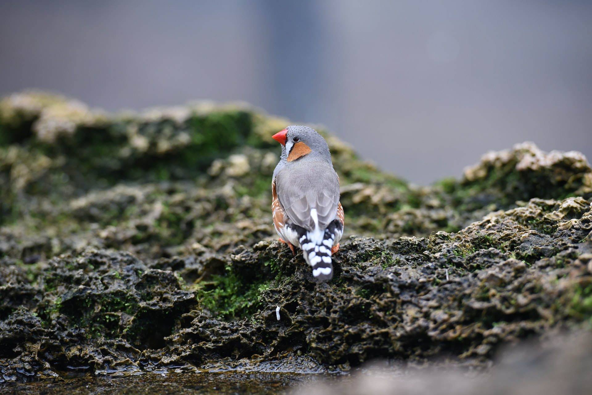
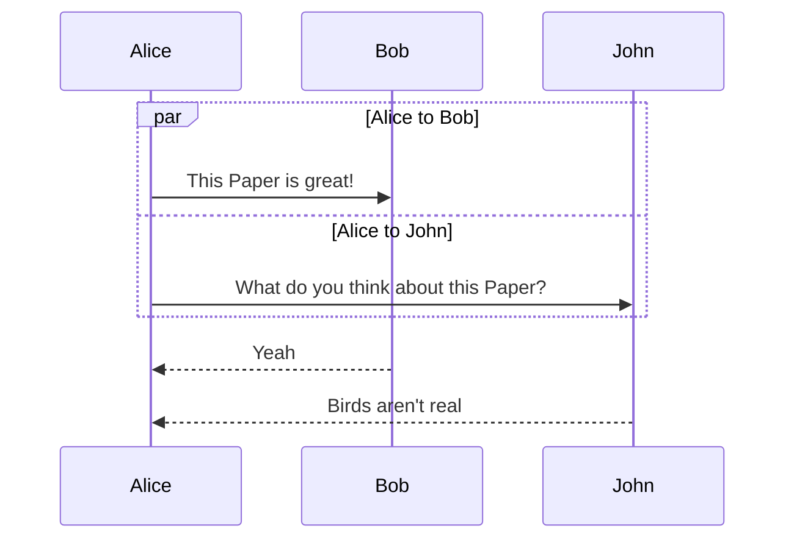

# The zebra finch

The _**zebra finch**_ (**Poephila guttata**) is a sexually dimorphic, social estrildid native to the grasslands of Australia. They are opportunistic, year-round breeders which nest in colonies of variable size. Zebra finches form permanent pair bonds and both sexes share the responsibilities of nest building, incubation and rearing of young [@importantReference]. Morris, however, reported that although both sexes pick up and nibble on fragments of material, males collect most of the nesting material.

Studies on the effects of colored plastic leg bands on pair formation show that male zebra finches spend more time sitting next to females wearing black or pink leg bands than females wearing light blue leg bands. The same studies indicate that females spend more time sitting next to males wearing red leg bands than males wearing light green bands. In both *male* and _female_, orange leg bands (which are similar to natural leg color) proved to be of intermediate preference [@importantReference].

 .7

The purpose of this study was to test whether or not this preference for certain colors of leg bands generalizes to preference for certain colors of nesting material. It was hypothesized that zebra finches would collect more red or black material than light green, with collection of orange being intermediate.

# Methods

The zebra finches used in this study were in three colonies in the lab of Dr. J.R. Baylis at the University of Wisconsin, Madison. Each colony contained between thirty and forty individual birds of both sexes, a variety of ages and several plumage types. All animals wore colored leg bands for individual identification and all had been exposed to grass, green embroidery floss and white dog fur as nesting material previous to this study. The colonies were housed in separate rooms, each approximately `17m^3` and each contained eight artificial nest boxes. All behavioral observations were made from outside the colony rooms through one-way mirrors.

```dockerfile
FROM finch:latest

WORKDIR /paper

RUN apt-get update && \
    apt-get install -y \
    zebrafinch

RUN finch --zebra

COPY entrypoint.sh /
RUN chmod 755 /entrypoint.sh
ENTRYPOINT ["/entrypoint.sh"]
```

Red, black, orange and light green DMC four-ply cotton embroidery floss was cut into `2.5cm` pieces. During each trial, twenty-five pieces of each color were separated and spread out over the floor of the colony. After the birds had been exposed to the material for a total of two hours, any remaining strands of floss on the floor were collected. The number of strands of each color was counted. It was assumed all other strands (not on the floor) had been used in nest construction. Data from the three colonies were pooled and an `X^2` goodness-of-fit test was used to determine whether the number of strands of each color used in nest construction different from an expected ratio of `1:1:1:1` (which would indicate no preference).

# Results

More green material was removed by the finches than red, more red than black and more black than orange. The ratio between material of different colors used in nest construction differed significantly from the expected `1:1:1:1` (`X^2=63.44, df=3, p<.005`). When colors were compared in pairs, the difference between values for green and red were not significantly different (`X^2=117, df=1, p>.5`). However, the values for black and orange were significantly different (`X^2=36.38, df=1, p<.005`).



\fill

# Discussion

The results from these experiments suggest that zebra finches do in fact have color preferences with regard to nesting material. Contrary to the predictions made by generalizing Burley studies [@anotherImportantReference], however, the zebra finches used in this study preferred green, red or black nesting material to orange. These results are similar to those of Collias and Collias (1981) who showed that weaver birds preferred green nesting material.

It is possible that zebra finches prefer green material to red, black and orange because green is more similar to the color of the grasses commonly used as nesting material in their natural environment. This interpretation, however, does not explain the preference for red and black materials over orange.


Alternatively, it is possible that the strong preference shown for green material may be a result of imprinting on the color of the nests they grew up in. It has been shown, for example, that parental plumage color has a strong effect on mate selection in male (but not female) zebra finches [@anotherImportantReference]. All of the birds used in this study have been exposed to grass, green embroidery floss and white dog fur in nests. If as suggested by Morris [@importantReference] males collect most of the nesting material, imprinting could have a strong effect on the numbers of colored strands collected in this study. This hypothesis could be tested by raising zebra finches in nests containing different colors of nesting materials and testing them in adulthood for preference in nest material color. When setting up this experiment, it was noted that zebra finches seem particularly apprehensive about new objects placed in the colony. It is also possible, therefore, that the preference for green nest material was simply due to its familiarity.

\fill

\fill

# Origins of this Paper

The text content of this paper was copied from the University of Wisconsin–Madison [@SamplePaperScientific2017], with slight alterations. The images are from Unsplash [@birdRef] [@notBirdRef].